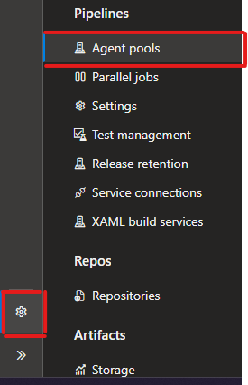
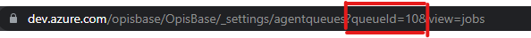

# Azure DevOps Agent in Kubernetes

# Install

1. To use this template, u need create a secrets in your cluster, use a follow command to create this secrets:

````bash
kubectl create ns az-agent
kubectl create secret generic azo \
  --from-literal=AZP_URL=https://dev.azure.com/{{ORG_NAME}} \
  --from-literal=AZP_TOKEN={{PAT_TOKEN}} \
  --from-literal=AZP_POOL={{AGENT_POOL}} \
  --from-literal=ENV_NAME={{ENV_NAME}}
  -n az-agent
````

2. Example to populate values:

````bash
kubectl create secret generic azo --from-literal=AZP_URL=https://dev.azure.com/opisbase --from-literal=AZP_TOKEN=l4yybdkgihwofefcxkyddcwddjojighr2rfrydh3xlgaxnf4hziq --from-literal=AZP_POOL=WB-Pool --from-literal=ENV_NAME=PROD
````

3. Now build a container image and push it to ECR with follow command:

````bash
docker build --tag azure-agent:latest .
docker tag azure-agent:latest ${AWS.AccountID}.dkr.ecr.${AWS.Region}.amazonaws.com/azure-devops:latest
docker push ${AWS.AccountID}.dkr.ecr.${AWS.Region}.amazonaws.com/azure-devops:latest
````

4. After this change in manifest.yaml the image link container example:

````bash
spec:
  containers:
  - name: azdevops-agent
    image: "98765431223.dkr.ecr.us-east-1.amazonaws.com/azure-devops:latest"
````

5. Change the scaled obj keda the value PoolID (follow steps to get this values)

To get PoolID enter in Project Config > Agent Pool:



Enter in your pool and get value QueueID in yout URL:



Now change in scaled obj:
````bash
triggers:
- type: azure-pipelines
  metadata:
    poolID: "10" #### Change Here
    organizationURLFromEnv: "AZP_URL"
  authenticationRef:
    name: pipeline-trigger-auth
````

Apply manifest.yaml and scaled-obj-keda-azo.yml follow command:
````bash
kubectl apply -f . -n az-agent
````

